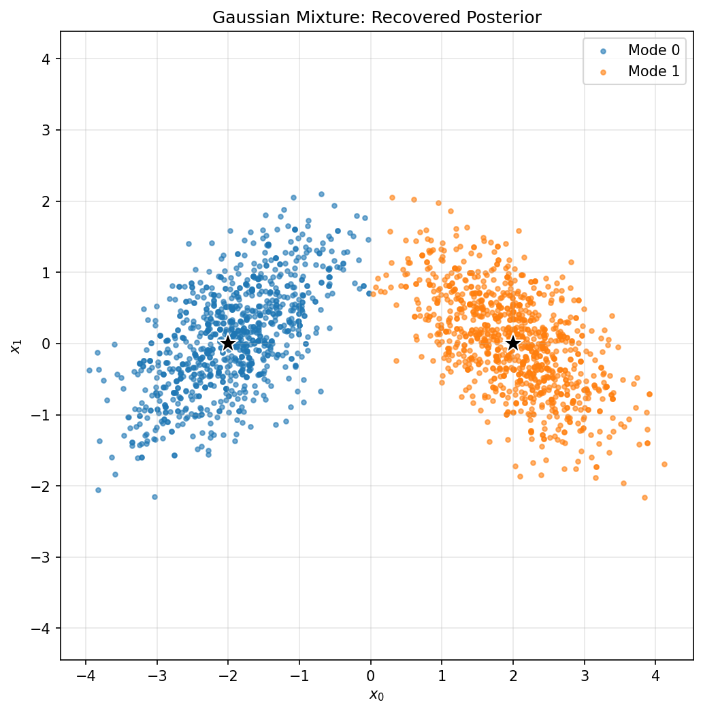

# Gaussian Mixture

This example demonstrates sampling from a multimodal Gaussian mixture distribution.

## Problem Description

A Gaussian mixture model is defined as:

$$
p(x) = \sum_{k=1}^{K} w_k \, \mathcal{N}(x \mid \mu_k, \Sigma_k)
$$

where $w_k$ are mixture weights, $\mu_k$ are means, and $\Sigma_k$ are covariance matrices.

Multimodal distributions are challenging because samplers can get stuck in a single mode.

---

## Two-Mode Example

```python
import numpy as np
import tempest as tp
from scipy.stats import multivariate_normal
import matplotlib.pyplot as plt

# Setup
n_dim = 2

# Define two Gaussian modes
means = [
    np.array([-2.0, 0.0]),
    np.array([2.0, 0.0]),
]
covs = [
    np.array([[0.5, 0.3], [0.3, 0.5]]),
    np.array([[0.5, -0.3], [-0.3, 0.5]]),
]
weights = [0.5, 0.5]  # Equal weights

# Prior transform: wide uniform U(-10, 10)
def prior_transform(u):
    return 20 * u - 10

def log_likelihood(x):
    """Log-likelihood of Gaussian mixture."""
    x = np.atleast_2d(x)
    
    log_probs = []
    for w, mu, cov in zip(weights, means, covs):
        log_probs.append(
            np.log(w) + multivariate_normal.logpdf(x, mean=mu, cov=cov)
        )
    
    # Log-sum-exp for numerical stability
    log_probs = np.array(log_probs)
    result = np.logaddexp.reduce(log_probs, axis=0)
    
    return result.squeeze() if result.size == 1 else result

# Create sampler with clustering enabled
sampler = tp.Sampler(
    prior_transform=prior_transform,
    log_likelihood=log_likelihood,
    n_dim=n_dim,
    n_effective=512,
    n_active=256,
    clustering=True,  # Important for multimodal!
    vectorize=True,
    random_state=42,
)

# Run
sampler.run(n_total=4096)

# Results
samples, weights_post, logl = sampler.posterior()
logz, _ = sampler.evidence()

print(f"Collected {len(samples)} samples")
print(f"Log-evidence: {logz:.2f}")
```

---

## Visualization

```python
# Resample to get unweighted samples
idx = np.random.choice(len(samples), size=2000, p=weights_post, replace=True)
samples_plot = samples[idx]

# Plot
fig, ax = plt.subplots(figsize=(8, 8))

# Samples
ax.scatter(samples_plot[:, 0], samples_plot[:, 1], alpha=0.3, s=5)

# True mode locations
for mu in means:
    ax.scatter(*mu, c='red', s=100, marker='x', linewidths=3)

ax.set_xlabel('$x_0$')
ax.set_ylabel('$x_1$')
ax.set_title('Gaussian Mixture Posterior Samples')
ax.set_aspect('equal')
plt.savefig('gaussian_mixture.png', dpi=150)
```

**Result**



The scatter plot shows the recovered posterior samples with the true mode locations marked as red crosses.

---

## Mode Weights Analysis

Check if both modes are recovered with correct weights:

```python
# Classify samples by closest mode
def classify_samples(samples, means):
    distances = np.array([
        np.linalg.norm(samples - mu, axis=1) 
        for mu in means
    ])
    return np.argmin(distances, axis=0)

labels = classify_samples(samples, means)

for k in range(len(means)):
    mask = labels == k
    weight_k = np.sum(weights_post[mask])
    print(f"Mode {k}: weight = {weight_k:.3f} (true: {weights[k]:.3f})")
```

---

## Many-Mode Example

A more challenging example with 5 modes:

```python
import numpy as np
import tempest as tp
from scipy.stats import uniform, multivariate_normal

n_dim = 2
n_modes = 5

# Modes arranged in a circle
np.random.seed(42)
angles = np.linspace(0, 2*np.pi, n_modes, endpoint=False)
radius = 3.0

means = [radius * np.array([np.cos(a), np.sin(a)]) for a in angles]
covs = [0.3 * np.eye(n_dim) for _ in range(n_modes)]
mode_weights = np.ones(n_modes) / n_modes

def prior_transform(u):
    return 20 * u - 10  # U(-10, 10)

def log_likelihood(x):
    x = np.atleast_2d(x)
    log_probs = []
    for w, mu, cov in zip(mode_weights, means, covs):
        log_probs.append(
            np.log(w) + multivariate_normal.logpdf(x, mean=mu, cov=cov)
        )
    log_probs = np.array(log_probs)
    return np.logaddexp.reduce(log_probs, axis=0).squeeze()

# Need more particles for more modes
sampler = tp.Sampler(
    prior_transform=prior_transform,
    log_likelihood=log_likelihood,
    n_dim=n_dim,
    n_effective=1024,
    n_active=512,
    clustering=True,
    vectorize=True,
)

sampler.run(n_total=8192)

samples, weights_post, _ = sampler.posterior()

# Check mode recovery
labels = classify_samples(samples, means)
print("\nMode weights:")
for k in range(n_modes):
    mask = labels == k
    weight_k = np.sum(weights_post[mask])
    print(f"  Mode {k}: {weight_k:.3f} (true: {mode_weights[k]:.3f})")
```

---

## High-Dimensional Mixture

For higher dimensions with well-separated modes:

```python
n_dim = 10
n_modes = 3

# Create well-separated modes
means = [
    np.zeros(n_dim),
    np.concatenate([[5], np.zeros(n_dim-1)]),
    np.concatenate([[-5], np.zeros(n_dim-1)]),
]
covs = [np.eye(n_dim) for _ in range(n_modes)]
mode_weights = [0.5, 0.25, 0.25]

def prior_transform(u):
    return 30 * u - 15  # U(-15, 15)

def log_likelihood(x):
    x = np.atleast_2d(x)
    log_probs = []
    for w, mu, cov in zip(mode_weights, means, covs):
        log_probs.append(
            np.log(w) + multivariate_normal.logpdf(x, mean=mu, cov=cov)
        )
    log_probs = np.array(log_probs)
    return np.logaddexp.reduce(log_probs, axis=0).squeeze()

sampler = tp.Sampler(
    prior_transform=prior_transform,
    log_likelihood=log_likelihood,
    n_dim=n_dim,
    n_effective=2048,
    n_active=512,
    clustering=True,
    n_boost=1024,
)

sampler.run(n_total=8192)
```

---

## Tips for Multimodal Sampling

!!! success "Key Settings"
    - **Always enable clustering** (`clustering=True`)
    - Increase `n_effective` with number of modes
    - Use `n_boost > n_effective` to add particles as modes are discovered

!!! tip "Mode Discovery"
    - Wide priors help discover all modes
    - Watch the `K` value in progress bar for cluster count
    - The USS metric (`metric='uss'`) can be more reliable

!!! warning "Mode Collapse"
    If sampling collapses to one mode:
    - Increase `n_effective` and `n_active`
    - Lower `split_threshold` to encourage more clusters
    - Check that prior covers all modes
