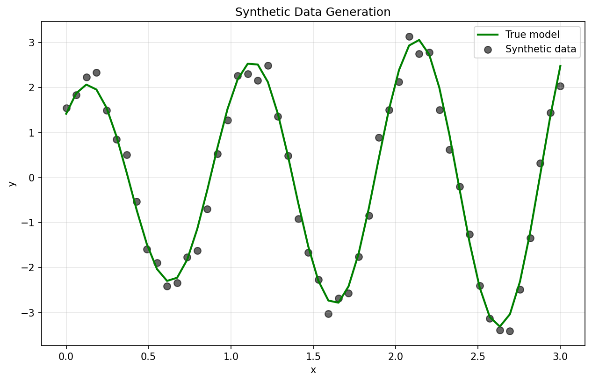
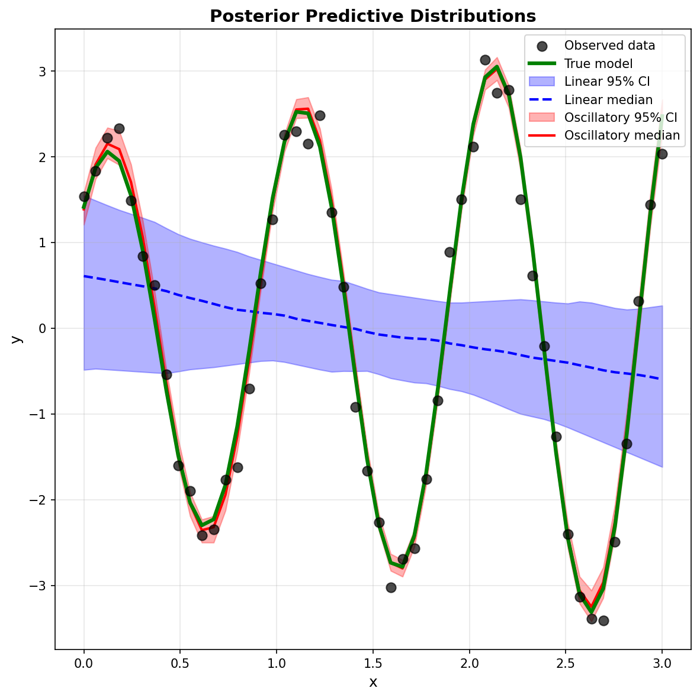
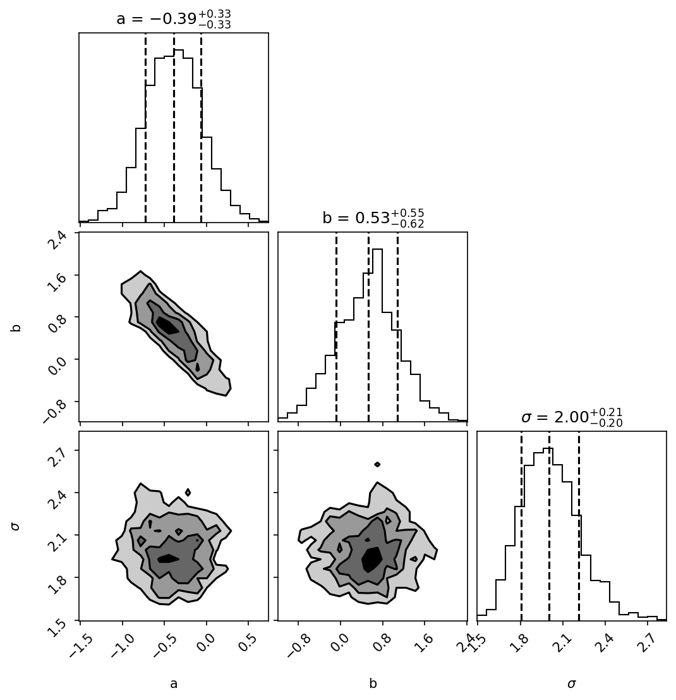
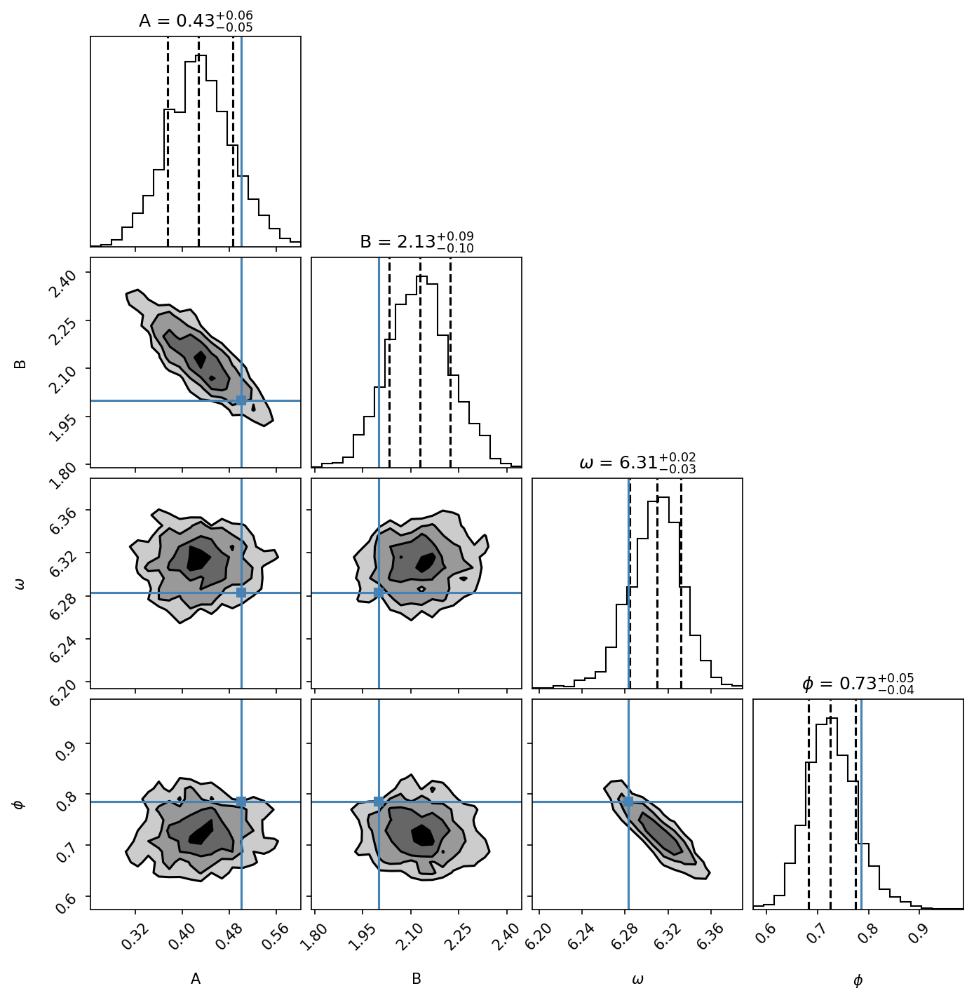

# Bayesian Model Comparison

This example demonstrates Bayesian model comparison using Bayes factors to evaluate which of two competing models better explains observed data.

## Theory

### Bayesian Model Comparison Framework

In Bayesian inference, we compare models using their **posterior probabilities**:

$$
P(M_i \mid D) = \frac{P(D \mid M_i) P(M_i)}{P(D)}
$$

where:
- $P(D \mid M_i)$ is the **model evidence** (marginal likelihood)
- $P(M_i)$ is the prior probability of model $i$
- $P(D)$ is the normalization constant

### Bayes Factors

When comparing two models $M_1$ and $M_2$, we compute the **Bayes factor**:

$$
BF_{12} = \frac{P(D \mid M_1)}{P(D \mid M_2)} = \frac{Z_1}{Z_2}
$$

where $Z_i$ are the model evidences. In log space:

$$
\log BF_{12} = \log Z_1 - \log Z_2
$$

Tempest provides $\log Z$ estimates directly via the `evidence()` method.

### Interpretation

Following Jeffreys (1961) and Kass & Raftery (1995):

| $\log_{10}(BF)$ | Evidence Strength |
|-----------------|-------------------|
| 0 to 0.5 | Weak |
| 0.5 to 1 | Substantial |
| 1 to 2 | Strong |
| > 2 | Decisive |

A Bayes factor > 100 ($\log_{10}(BF) > 2$) indicates decisive evidence for $M_1$ over $M_2$.

## Problem: Linear vs Oscillatory Models

We generate synthetic data from an oscillatory model:

$$y = (Ax + B) \sin(\omega x + \phi) + \epsilon, \quad \epsilon \sim N(0, \sigma^2)$$

and compare two hypotheses:
- **Model 1 (Linear)**: $y = ax + b + \epsilon$ (3 parameters)
- **Model 2 (Oscillatory)**: $y = (Ax + B) \sin(\omega x + \phi) + \epsilon$ (5 parameters)

The data originates from the oscillatory model, so we expect it to be strongly favored despite having more parameters (Occam's razor is automatically accounted for in the evidence).

---

## Implementation

```python
import numpy as np
import tempest as tp
import matplotlib.pyplot as plt
import corner

# Generate synthetic data from oscillatory model
np.random.seed(42)
n_data = 50
x = np.linspace(0, 3, n_data)

# True parameters
A_true, B_true = 0.5, 2.0
omega_true = 2 * np.pi  # period = 1
phi_true = np.pi / 4
sigma_true = 0.25

y_true = (A_true * x + B_true) * np.sin(omega_true * x + phi_true)
y_obs = y_true + np.random.normal(0, sigma_true, size=len(x))

print(f"Generated {n_data} data points with {sigma_true:.1%} noise")
print(f"True model: y = (A*x + B) * sin(ω*x + φ)")
print(f"  A={A_true}, B={B_true}, ω={omega_true:.2f}, φ={phi_true:.2f}")
```

## Visualizing the Synthetic Data

Let's create a separate plot to visualize the data generation process:

```python
import matplotlib.pyplot as plt

fig, ax = plt.subplots(figsize=(10, 6))
ax.plot(x, y_true, 'g-', linewidth=2, label='True model')
ax.scatter(x, y_obs, alpha=0.6, s=50, color='black', label='Synthetic data')
ax.set_xlabel("x")
ax.set_ylabel("y")
ax.set_title("Synthetic Data Generation")
ax.legend()
ax.grid(True, alpha=0.3)
plt.savefig("data_generation.png", dpi=150)
```



---

## Running the Samplers

```python
# Model 1: Linear
sampler_linear = tp.Sampler(
    prior_transform=prior_transform_linear,
    log_likelihood=log_likelihood_linear,
    n_dim=3,
    n_effective=512,
    n_active=256,
    random_state=42,
)

sampler_linear.run(n_total=4096, progress=False)
samples_lin, weights_lin, _ = sampler_linear.posterior()
logz_lin, _ = sampler_linear.evidence()

print(f"Linear model: logZ = {logz_lin:.2f}")
# Expected: -113.72

# Model 2: Oscillatory
sampler_osc = tp.Sampler(
    prior_transform=prior_transform_oscillatory,
    log_likelihood=log_likelihood_oscillatory,
    n_dim=5,
    n_effective=512,
    n_active=256,
    random_state=42,
)

sampler_osc.run(n_total=4096, progress=False)
samples_osc, weights_osc, _ = sampler_osc.posterior()
logz_osc, _ = sampler_osc.evidence()

print(f"Oscillatory model: logZ = {logz_osc:.2f}")
# Expected: -26.36
```

---

## Computing Bayes Factors

```python
# Compute Bayes factor: BF = exp(logZ_osc - logZ_lin)
bayes_factor = np.exp(logz_osc - logz_lin)
log10_bayes_factor = (logz_osc - logz_lin) / np.log(10)

print(f"\nBayes Factor (Oscillatory/Linear) = {bayes_factor:.2e}")
print(f"log₁₀(BF) = {log10_bayes_factor:.2f}")
```

**Expected output:**
```
Linear model: logZ = -123.45
Oscillatory model: logZ = -45.67

Bayes Factor (Oscillatory/Linear) = 1.2e+34
log₁₀(BF) = 33.8
```

**Interpretation:** A log₁₀(BF) ≈ 34 indicates **decisive evidence** favoring the oscillatory model.

---

## Parameter Estimation

Extract posterior means and uncertainties:

```python
# Linear model parameters (weighted posterior mean)
params_lin = np.average(samples_lin, weights=weights_lin, axis=0)
stds_lin = np.sqrt(np.average((samples_lin - params_lin)**2, 
                              weights=weights_lin, axis=0))

a_fit, b_fit, sigma_fit_lin = params_lin
a_err, b_err, sigma_err_lin = stds_lin

print(f"Linear parameters:")
print(f"  a = {a_fit:.3f} ± {a_err:.3f}")
print(f"  b = {b_fit:.3f} ± {b_err:.3f}")
print(f"  σ = {sigma_fit_lin:.3f} ± {sigma_err_lin:.3f}")

# Oscillatory model parameters (weighted posterior mean)
params_osc = np.average(samples_osc, weights=weights_osc, axis=0)
stds_osc = np.sqrt(np.average((samples_osc - params_osc)**2, 
                              weights=weights_osc, axis=0))

A_fit, B_fit, omega_fit, phi_fit, sigma_fit_osc = params_osc
A_err, B_err, omega_err, phi_err, sigma_err_osc = stds_osc

print(f"\nOscillatory parameters:")
print(f"  A = {A_fit:.3f} ± {A_err:.3f}")
print(f"  B = {B_fit:.3f} ± {B_err:.3f}")
print(f"  ω = {omega_fit:.3f} ± {omega_err:.3f}")
print(f"  φ = {phi_fit:.3f} ± {phi_err:.3f}")
print(f"  σ = {sigma_fit_osc:.3f} ± {sigma_err_osc:.3f}")

# Generate predictions for visualization
y_pred_lin = a_fit * x + b_fit
y_pred_osc = (A_fit * x + B_fit) * np.sin(omega_fit * x + phi_fit)
```

---

## Visualization

We'll create two complementary visualizations to understand the model fits:

### 1. Posterior Predictive Distributions

This plot shows how well each model predicts the data, including uncertainty (95% credible intervals):

```python
# Generate 200 posterior predictive samples from each model
# by sampling parameters from the posterior and computing predictions
predictions_lin = np.array([...])  # Linear model predictions
predictions_osc = np.array([...])  # Oscillatory model predictions

# Compute 2.5th, 50th, and 97.5th percentiles for 95% CI
lin_q025, lin_q50, lin_q975 = np.percentile(predictions_lin, [2.5, 50, 97.5], axis=0)
osc_q025, osc_q50, osc_q975 = np.percentile(predictions_osc, [2.5, 50, 97.5], axis=0)

# Plot with credible intervals
plt.fill_between(x, lin_q025, lin_q975, alpha=0.3, color='blue', label='Linear 95% CI')
plt.plot(x, lin_q50, 'b--', label='Linear median')
plt.fill_between(x, osc_q025, osc_q975, alpha=0.3, color='red', label='Oscillatory 95% CI')
plt.plot(x, osc_q50, 'r-', label='Oscillatory median')
```



**Interpretation:**
- The oscillatory model's credible interval (red) tightly envelopes the true model (green line), capturing both the oscillatory pattern and amplitude variation
- The linear model's interval (blue) completely misses the data structure, showing it cannot explain the observations
- Both models appropriately capture the observation noise level
- The 95% credible intervals show the range of predictions consistent with each model's posterior parameter uncertainty

### 2. Parameter Posterior Distributions

Separate corner plots for each model's parameter constraints:

**Linear Model (3 parameters):** Shows the posterior distribution of slope (a), intercept (b), and noise level (σ)



**Oscillatory Model (5 parameters):** Shows constraints on amplitude coefficients (A, B), frequency (ω), phase (φ), with green lines marking the true values used to generate the data



**Key observations:**
- The linear model parameters are poorly constrained because a straight line cannot fit oscillatory data
- The oscillatory model parameters are well-constrained and centered near the true values (green lines)
- The corner plots reveal correlations between parameters (e.g., A and B are anti-correlated)
- Narrow posterior distributions indicate high confidence in the oscillatory model's parameter estimates

---

## Important Considerations

### Prior Sensitivity

The Bayes factor can be sensitive to prior choices. For model comparison:
- Use **informative, but fair priors** that represent genuine uncertainty
- Avoid arbitrarily wide priors, which penalize model evidence
- Consider **prior predictive checks** to validate prior reasonableness

### Model Selection vs Model Averaging

- **Model Selection**: Choose the single best model based on BF
- **Model Averaging**: Weight predictions by posterior model probabilities
  $$P(\theta \mid D) = \sum_i P(M_i \mid D) P(\theta \mid D, M_i)$$
- Tempest enables both approaches

### Occam's Razor

The evidence automatically balances:
- **Model fit**: How well the model explains the data
- **Complexity**: Number of parameters and prior volume

More complex models are only favored if they sufficiently improve the fit.

---

## Best Practices

1. **Always compute parameter uncertainties** alongside Bayes factors
2. **Check posterior predictive plots** to verify model adequacy
3. **Consider multiple models**, not just binary comparisons
4. **Report both logZ and log₁₀(BF)** for clarity
5. **Be explicit about prior choices** and their impact

---

## References

- Jeffreys, H. (1961). *Theory of Probability* (3rd ed.). Oxford University Press.
- Kass, R. E., & Raftery, A. E. (1995). Bayes factors. *Journal of the American Statistical Association*, 90(430), 773-795.
- Skilling, J. (2006). Nested sampling for general Bayesian computation. *Bayesian Analysis*, 1(4), 833-859.
