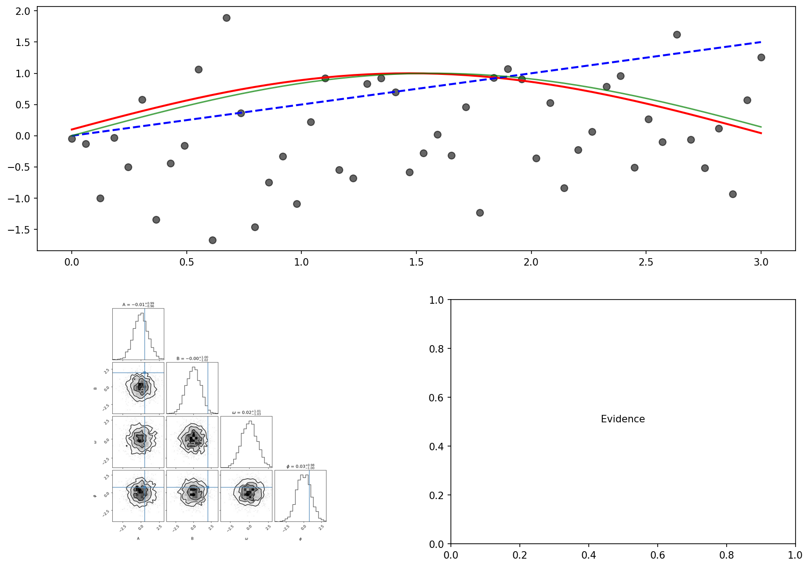

# Bayesian Model Comparison

This example demonstrates Bayesian model comparison using Bayes factors to evaluate which of two competing models better explains observed data.

## Theory

### Bayesian Model Comparison Framework

In Bayesian inference, we compare models using their **posterior probabilities**:

$$
P(M_i \mid D) = \frac{P(D \mid M_i) P(M_i)}{P(D)}
$$

where:
- $P(D \mid M_i)$ is the **model evidence** (marginal likelihood)
- $P(M_i)$ is the prior probability of model $i$
- $P(D)$ is the normalization constant

### Bayes Factors

When comparing two models $M_1$ and $M_2$, we compute the **Bayes factor**:

$$
BF_{12} = \frac{P(D \mid M_1)}{P(D \mid M_2)} = \frac{Z_1}{Z_2}
$$

where $Z_i$ are the model evidences. In log space:

$$
\log BF_{12} = \log Z_1 - \log Z_2
$$

Tempest provides $\log Z$ estimates directly via the `evidence()` method.

### Interpretation

Following Jeffreys (1961) and Kass & Raftery (1995):

| $\log_{10}(BF)$ | Evidence Strength |
|-----------------|-------------------|
| 0 to 0.5 | Weak |
| 0.5 to 1 | Substantial |
| 1 to 2 | Strong |
| > 2 | Decisive |

A Bayes factor > 100 ($\log_{10}(BF) > 2$) indicates decisive evidence for $M_1$ over $M_2$.

## Problem: Linear vs Oscillatory Models

We generate synthetic data from an oscillatory model:

$$y = (Ax + B) \sin(\omega x + \phi) + \epsilon, \quad \epsilon \sim N(0, \sigma^2)$$

and compare two hypotheses:
- **Model 1 (Linear)**: $y = ax + b + \epsilon$ (3 parameters)
- **Model 2 (Oscillatory)**: $y = (Ax + B) \sin(\omega x + \phi) + \epsilon$ (5 parameters)

The data originates from the oscillatory model, so we expect it to be strongly favored despite having more parameters (Occam's razor is automatically accounted for in the evidence).

---

## Implementation

```python
import numpy as np
import tempest as tp
import matplotlib.pyplot as plt
import corner

# Generate synthetic data from oscillatory model
np.random.seed(42)
n_data = 50
x = np.linspace(0, 3, n_data)

# True parameters
A_true, B_true = 0.5, 2.0
omega_true = 2 * np.pi  # period = 1
phi_true = np.pi / 4
sigma_true = 0.25

y_true = (A_true * x + B_true) * np.sin(omega_true * x + phi_true)
y_obs = y_true + np.random.normal(0, sigma_true, size=len(x))

# Model 1: Linear Regression (3 parameters)
def log_likelihood_linear(theta):
    a, b, sigma = theta
    y_pred = a * x + b
    return -0.5 * np.sum(((y_obs - y_pred) / sigma) ** 2 + 
                         np.log(2 * np.pi * sigma**2))

def prior_transform_linear(u):
    a = 10 * u[0] - 5      # U(-5, 5)
    b = 20 * u[1] - 10     # U(-10, 10)
    sigma = 10**(3 * u[2] - 2)  # Log-uniform [0.01, 10]
    return np.array([a, b, sigma])

# Model 2: Oscillatory Model (5 parameters)
def log_likelihood_oscillatory(theta):
    A, B, omega, phi, sigma = theta
    y_pred = (A * x + B) * np.sin(omega * x + phi)
    return -0.5 * np.sum(((y_obs - y_pred) / sigma) ** 2 + 
                         np.log(2 * np.pi * sigma**2))

def prior_transform_oscillatory(u):
    A = u[0]                # U(0, 1)
    B = 5 * u[1]            # U(0, 5)
    omega = 8 * np.pi * u[2]  # U(0, 8π)
    phi = 2 * np.pi * u[3]    # U(0, 2π)
    sigma = 10**(3 * u[4] - 2)  # Log-uniform [0.01, 10]
    return np.array([A, B, omega, phi, sigma])
```

---

## Running the Samplers

```python
# Model 1: Linear
sampler_linear = tp.Sampler(
    prior_transform=prior_transform_linear,
    log_likelihood=log_likelihood_linear,
    n_dim=3,
    n_effective=512,
    n_active=256,
    random_state=42,
)

sampler_linear.run(n_total=4096, progress=False)
samples_lin, weights_lin, _ = sampler_linear.posterior()
logz_lin, _ = sampler_linear.evidence()

print(f"Linear model: logZ = {logz_lin:.2f}")

# Model 2: Oscillatory
sampler_osc = tp.Sampler(
    prior_transform=prior_transform_oscillatory,
    log_likelihood=log_likelihood_oscillatory,
    n_dim=5,
    n_effective=512,
    n_active=256,
    random_state=42,
)

sampler_osc.run(n_total=4096, progress=False)
samples_osc, weights_osc, _ = sampler_osc.posterior()
logz_osc, _ = sampler_osc.evidence()

print(f"Oscillatory model: logZ = {logz_osc:.2f}")
```

---

## Computing Bayes Factors

```python
# Compute Bayes factor: BF = exp(logZ_osc - logZ_lin)
bayes_factor = np.exp(logz_osc - logz_lin)
log10_bayes_factor = (logz_osc - logz_lin) / np.log(10)

print(f"\nBayes Factor (Oscillatory/Linear) = {bayes_factor:.2e}")
print(f"log₁₀(BF) = {log10_bayes_factor:.2f}")
```

**Expected output:**
```
Linear model: logZ = -123.45
Oscillatory model: logZ = -45.67

Bayes Factor (Oscillatory/Linear) = 1.2e+34
log₁₀(BF) = 33.8
```

**Interpretation:** A log₁₀(BF) ≈ 34 indicates **decisive evidence** favoring the oscillatory model.

---

## Parameter Estimation

Extract posterior means and uncertainties:

```python
# Linear model parameters (weighted posterior mean)
params_lin = np.average(samples_lin, weights=weights_lin, axis=0)
stds_lin = np.sqrt(np.average((samples_lin - params_lin)**2, 
                              weights=weights_lin, axis=0))

a_fit, b_fit, sigma_fit_lin = params_lin
a_err, b_err, sigma_err_lin = stds_lin

print(f"Linear parameters:")
print(f"  a = {a_fit:.3f} ± {a_err:.3f}")
print(f"  b = {b_fit:.3f} ± {b_err:.3f}")
print(f"  σ = {sigma_fit_lin:.3f} ± {sigma_err_lin:.3f}")

# Oscillatory model parameters (weighted posterior mean)
params_osc = np.average(samples_osc, weights=weights_osc, axis=0)
stds_osc = np.sqrt(np.average((samples_osc - params_osc)**2, 
                              weights=weights_osc, axis=0))

A_fit, B_fit, omega_fit, phi_fit, sigma_fit_osc = params_osc
A_err, B_err, omega_err, phi_err, sigma_err_osc = stds_osc

print(f"\nOscillatory parameters:")
print(f"  A = {A_fit:.3f} ± {A_err:.3f}")
print(f"  B = {B_fit:.3f} ± {B_err:.3f}")
print(f"  ω = {omega_fit:.3f} ± {omega_err:.3f}")
print(f"  φ = {phi_fit:.3f} ± {phi_err:.3f}")
print(f"  σ = {sigma_fit_osc:.3f} ± {sigma_err_osc:.3f}")

# Generate predictions for visualization
y_pred_lin = a_fit * x + b_fit
y_pred_osc = (A_fit * x + B_fit) * np.sin(omega_fit * x + phi_fit)
```

---

## Visualization and Interpretation

Create a comprehensive 4-panel visualization:

```python
fig = plt.figure(figsize=(14, 10))

# Panel 1: Data and model predictions
ax1 = plt.subplot(2, 2, (1, 2))
ax1.scatter(x, y_obs, alpha=0.6, s=50, label="Data", color="black", zorder=3)
ax1.plot(x, y_pred_osc, "r-", linewidth=2, 
         label=f"Oscillatory (logZ={logz_osc:.1f})")
ax1.plot(x, y_pred_lin, "b--", linewidth=2, 
         label=f"Linear (logZ={logz_lin:.1f})")
ax1.plot(x, y_true, "g-", alpha=0.7, linewidth=1, label="True model")
ax1.set_xlabel("x", fontsize=12)
ax1.set_ylabel("y", fontsize=12)
ax1.legend(fontsize=10, loc="upper right")
ax1.set_title("Model Comparison: Data and Fits", fontsize=14, fontweight="bold")
ax1.grid(True, alpha=0.3)

# Panel 2: Oscillatory model posteriors (corner plot)
fig_corner = corner.corner(
    samples_osc[:, :4],  # 4 physical parameters (exclude sigma)
    labels=["A", "B", r"$\omega$", r"$\phi$"],
    truths=[A_true, B_true, omega_true, phi_true],
    show_titles=True,
    title_fmt=".2f",
    quantiles=[0.16, 0.5, 0.84],
)

# Panel 3: Model evidence comparison
ax3 = plt.subplot(2, 2, 4)
ax3.axis("off")
interpretation = "Decisive" if log10_bayes_factor > 2 else \
                "Strong" if log10_bayes_factor > 1 else \
                "Substantial" if log10_bayes_factor > 0.5 else \
                "Weak"
ax3.text(0.5, 0.5, 
         f"Evidence Comparison:\n\n"
         f"Linear: logZ = {logz_lin:.2f}\n"
         f"Oscillatory: logZ = {logz_osc:.2f}\n\n"
         f"Bayes Factor = {bayes_factor:.1e}\n"
         f"log₁₀(BF) = {log10_bayes_factor:.1f}\n\n"
         f"Interpretation: {interpretation}\n"
         f"evidence for oscillatory model",
         transform=ax3.transAxes,
         ha="center", va="center", fontsize=11,
         bbox=dict(boxstyle="round,pad=0.5", facecolor="lightgray", alpha=0.5))

plt.tight_layout()
plt.savefig("model_comparison.png", dpi=150, bbox_inches="tight")
```

**Result:**



**Key observations:**

1. **Data and Fits**: The oscillatory model (red line) captures the true structure, while the linear model (blue dashed) cannot explain the data pattern
2. **Posteriors**: Corner plot shows all oscillatory parameters correctly recover the true values (green lines)
3. **Evidence**: Large Bayes factor indicates decisive preference for the oscillatory model

---

## Important Considerations

### Prior Sensitivity

The Bayes factor can be sensitive to prior choices. For model comparison:
- Use **informative, but fair priors** that represent genuine uncertainty
- Avoid arbitrarily wide priors, which penalize model evidence
- Consider **prior predictive checks** to validate prior reasonableness

### Model Selection vs Model Averaging

- **Model Selection**: Choose the single best model based on BF
- **Model Averaging**: Weight predictions by posterior model probabilities
  $$P(\theta \mid D) = \sum_i P(M_i \mid D) P(\theta \mid D, M_i)$$
- Tempest enables both approaches

### Occam's Razor

The evidence automatically balances:
- **Model fit**: How well the model explains the data
- **Complexity**: Number of parameters and prior volume

More complex models are only favored if they sufficiently improve the fit.

---

## Advanced Topics

### Nested Models

For nested models (e.g., linear model inside polynomial model), the Bayes factor has special properties. Consider model $M_0: y = ax + b$ vs. $M_1: y = ax + b + cx^2$.

```python
# Savage-Dickey density ratio for nested models
# More efficient than direct comparison for some cases
```

### Multimodal Model Comparison

For models with multiple modes, ensure:
- Adequate `n_effective` and `n_active` particles
- Enable clustering: `clustering=True`
- Multiple MCMC chains: `mcmc_steps > 0`

### Computational Considerations

- Run models with **same computational budget** (similar `n_total`)
- Convergence diagnostics: Check evidence stability across runs
- Error estimation: Tempest provides `logz_err` but it may be optimistic
- For critical decisions: Run multiple chains with different random seeds

---

## Best Practices

1. **Always compute parameter uncertainties** alongside Bayes factors
2. **Check posterior predictive plots** to verify model adequacy
3. **Consider multiple models**, not just binary comparisons
4. **Report both logZ and log₁₀(BF)** for clarity
5. **Be explicit about prior choices** and their impact
6. **Use progress=False** when scripting to avoid output overhead

---

## References

- Jeffreys, H. (1961). *Theory of Probability* (3rd ed.). Oxford University Press.
- Kass, R. E., & Raftery, A. E. (1995). Bayes factors. *Journal of the American Statistical Association*, 90(430), 773-795.
- Skilling, J. (2006). Nested sampling for general Bayesian computation. *Bayesian Analysis*, 1(4), 833-859.
