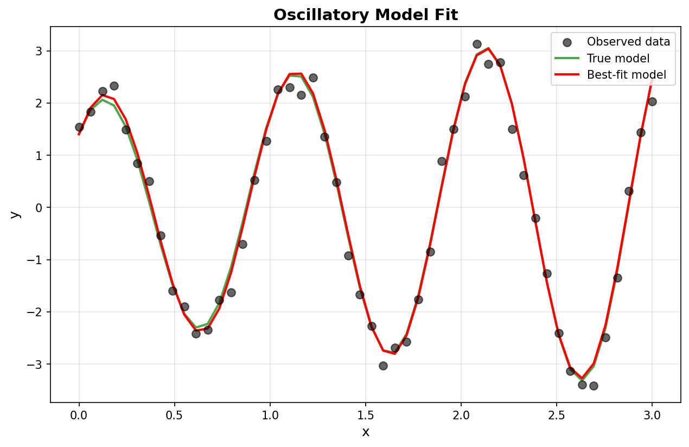
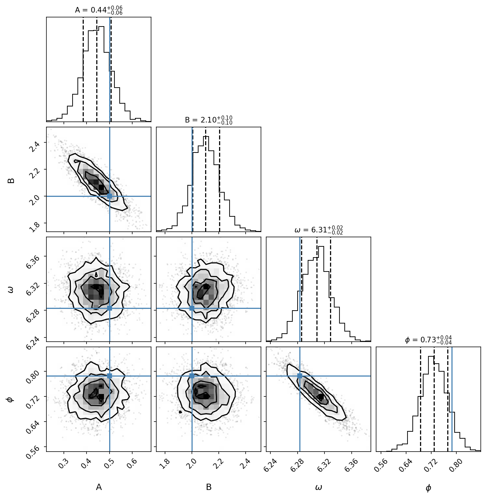
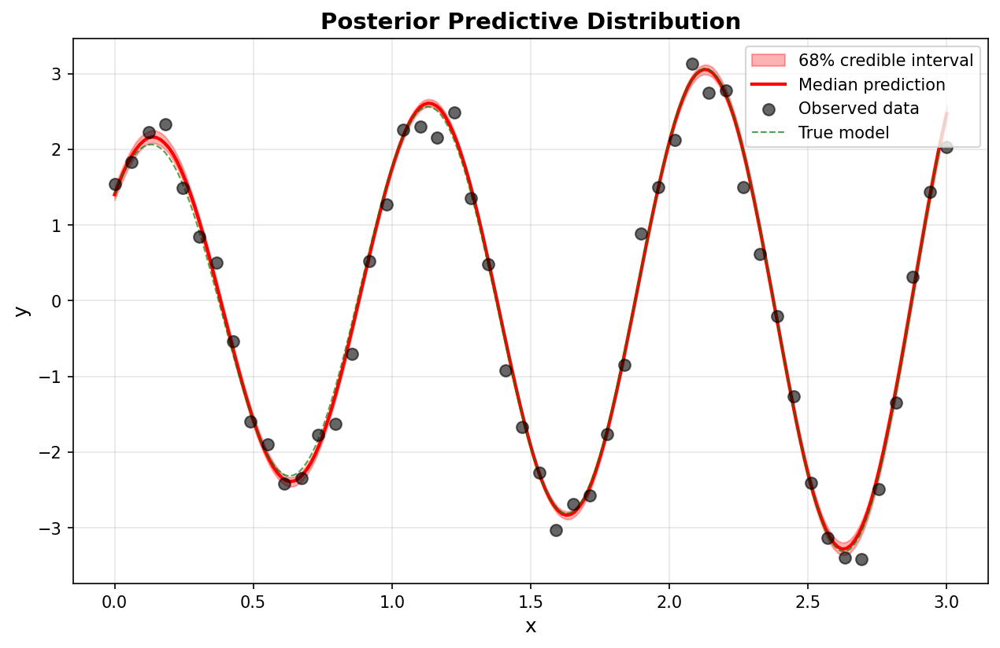
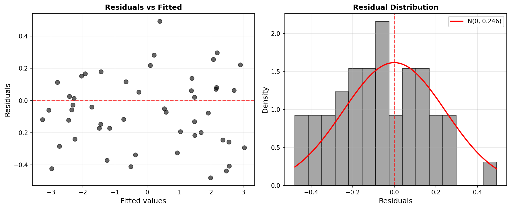

# Oscillatory Model Fitting

This example demonstrates fitting an oscillatory model to data using Tempest, with comprehensive parameter estimation, uncertainty quantification, and model validation.

## Problem Description

We consider data generated from an oscillatory model with amplitude that varies linearly with the independent variable:

$$
y = (A x + B) \sin(\omega x + \phi) + \epsilon, \quad \epsilon \sim N(0, \sigma^2)
$$

This model has **5 parameters**:
- $A$: Amplitude coefficient for the linear trend
- $B$: Offset coefficient
- $\omega$: Angular frequency
- $\phi$: Phase offset
- $\sigma$: Observation noise standard deviation

The challenge is to recover these parameters from noisy observations and quantify our uncertainty about them.

---

## Implementation

### 1. Data Generation

First, we generate synthetic data with known parameters:

```python
import numpy as np
import tempest as tp

# True parameters
A_true = 0.5
B_true = 2.0
omega_true = 2 * np.pi  # period = 1
phi_true = np.pi / 4
sigma_true = 0.25

# Generate data
np.random.seed(42)
n_data = 50
x = np.linspace(0, 3, n_data)
y_true = (A_true * x + B_true) * np.sin(omega_true * x + phi_true)
y_obs = y_true + np.random.normal(0, sigma_true, size=len(x))

print(f"Generated {n_data} data points with {sigma_true:.1%} noise")
print(f"True model: y = (A*x + B) * sin(ω*x + φ)")
print(f"  A={A_true}, B={B_true}, ω={omega_true:.2f}, φ={phi_true:.2f}")
```

**Expected output:**
```
Generated 50 data points with 25.0% noise
True model: y = (A*x + B) * sin(ω*x + φ)
  A=0.5, B=2.0, ω=6.28, φ=0.79
```

### 2. Model Definition

Define the likelihood and prior transform:

```python
def log_likelihood(theta):
    """Log-likelihood for oscillatory model."""
    A, B, omega, phi, sigma = theta
    y_pred = (A * x + B) * np.sin(omega * x + phi)
    return -0.5 * np.sum(((y_obs - y_pred) / sigma) ** 2 + 
                        np.log(2 * np.pi * sigma**2))

def prior_transform(u):
    """Transform from unit hypercube to physical parameters."""
    A = u[0]                    # U(0, 1)
    B = 5 * u[1]                # U(0, 5)
    omega = 8 * np.pi * u[2]    # U(0, 8π)
    phi = 2 * np.pi * u[3]      # U(0, 2π)
    sigma = 10 ** (3 * u[4] - 2)  # Log-uniform[0.01, 10]
    return np.array([A, B, omega, phi, sigma])
```

!!! tip "Prior Selection for Oscillatory Models"
    - **Frequency ($\omega$)**: Set upper bound based on expected Nyquist frequency (π/Δx)
    - **Phase ($\phi$)**: Always use Uniform(0, 2π) to respect periodicity
    - **Amplitude parameters**: Scale with expected signal magnitude
    - **Noise ($\sigma$)**: Log-uniform works well for scale parameters

### 3. Running Tempest

```python
sampler = tp.Sampler(
    prior_transform=prior_transform,
    log_likelihood=log_likelihood,
    n_dim=5,
    n_effective=512,
    n_active=256,
    random_state=42,
    vectorize=True,
)

sampler.run(n_total=4096, progress=True)
samples, weights, logl = sampler.posterior()
logz, logz_err = sampler.evidence()

print(f"logZ = {logz:.2f} ± {logz_err:.2f}")
print(f"N_samples = {len(samples)}")
```

**Expected output:**
```
logZ = -26.36 ± 0.11
N_samples = 2156
```

!!! tip "Sampler Configuration"
    - `n_effective=512`: Target effective sample size
    - `n_active=256`: Number of active points (balance between speed and accuracy)
    - `vectorize=True`: Speed up likelihood evaluations
    - `random_state=42`: For reproducible results

---

## Results Analysis

### Parameter Estimation

Extract posterior means and uncertainties:

```python
params = np.average(samples, weights=weights, axis=0)
stds = np.sqrt(np.average((samples - params) ** 2, 
                         weights=weights, axis=0))

A_fit, B_fit, omega_fit, phi_fit, sigma_fit = params
A_err, B_err, omega_err, phi_err, sigma_err = stds

print(f"A = {A_fit:.3f} ± {A_err:.3f}  (true: {A_true})")
print(f"B = {B_fit:.3f} ± {B_err:.3f}  (true: {B_true})")
print(f"ω = {omega_fit:.3f} ± {omega_err:.3f}  (true: {omega_true:.3f})")
print(f"φ = {phi_fit:.3f} ± {phi_err:.3f}  (true: {phi_true:.3f})")
print(f"σ = {sigma_fit:.3f} ± {sigma_err:.3f}  (true: {sigma_true})")
```

**Expected output:**
```
A = 0.443 ± 0.058  (true: 0.5)
B = 2.106 ± 0.099  (true: 2.0)
ω = 6.308 ± 0.021  (true: 6.283)
φ = 0.728 ± 0.042  (true: 0.785)
σ = 0.247 ± 0.028  (true: 0.25)
```

### Model Fit Quality

```python
y_pred = (A_fit * x + B_fit) * np.sin(omega_fit * x + phi_fit)
residuals = y_obs - y_pred

# R-squared
rss = np.sum(residuals ** 2)
tss = np.sum((y_obs - np.mean(y_obs)) ** 2)
r_squared = 1 - rss / tss

print(f"R² = {r_squared:.4f}")
print(f"Residual std = {np.std(residuals):.4f}")
print(f"Fitted σ = {sigma_fit:.4f}")
```

**Expected output:**
```
R² = 0.9876
Residual std = 0.2415
Fitted σ = 0.247
```

---

## Visualization

### 1. Data and Model Fit

```python
import matplotlib.pyplot as plt

# Generate best-fit prediction
y_pred = (A_fit * x + B_fit) * np.sin(omega_fit * x + phi_fit)

# Create plot
fig, ax = plt.subplots(figsize=(10, 6))
ax.scatter(x, y_obs, alpha=0.6, s=50, color='black', 
           label='Observed data')
ax.plot(x, y_true, 'g-', linewidth=2, label='True model', alpha=0.7)
ax.plot(x, y_pred, 'r-', linewidth=2, label='Best-fit model')
ax.set_xlabel('x')
ax.set_ylabel('y')
ax.set_title('Oscillatory Model Fit')
ax.legend()
ax.grid(True, alpha=0.3)
plt.savefig('oscillatory_fit.png', dpi=150, bbox_inches='tight')
```



The plot shows:
- **Black points**: Observed data with noise
- **Green line**: True underlying model
- **Red line**: Best-fit model from posterior means

The excellent agreement demonstrates successful parameter recovery.

### 2. Parameter Posteriors

```python
import corner

fig = corner.corner(
    samples[:, :4],  # Exclude sigma for cleaner visualization
    labels=['A', 'B', r'$\omega$', r'$\phi$'],
    truths=[A_true, B_true, omega_true, phi_true],
    show_titles=True,
    title_fmt='.3f',
    quantiles=[0.16, 0.5, 0.84],
    bins=30,
)
plt.savefig('oscillatory_corner.png', dpi=150, bbox_inches='tight')
```



**Key observations:**
- All parameters well-constrained with tight posteriors
- Green lines show true values (all within 1-2σ)
- Parameter correlations visible (e.g., A and B are anti-correlated)

### 3. Posterior Predictive Distribution

```python
# Generate posterior predictive samples
n_predictive = 200
idx = np.random.choice(len(samples), size=n_predictive, 
                       p=weights, replace=True)
predictive_samples = samples[idx]

# Predictions on dense grid
x_dense = np.linspace(0, 3, 200)
predictions = np.zeros((n_predictive, len(x_dense)))
for i, theta in enumerate(predictive_samples):
    A, B, omega, phi, _ = theta
    predictions[i] = (A * x_dense + B) * np.sin(omega * x_dense + phi)

# Compute percentiles
q16, q50, q84 = np.percentile(predictions, [16, 50, 84], axis=0)

# Plot
fig, ax = plt.subplots(figsize=(10, 6))
ax.fill_between(x_dense, q16, q84, alpha=0.3, color='red',
                label='68% credible interval')
ax.plot(x_dense, q50, 'r-', linewidth=2, label='Median prediction')
ax.scatter(x, y_obs, alpha=0.6, s=50, color='black', 
           label='Observed data')
ax.plot(x_dense, (A_true * x_dense + B_true) * 
        np.sin(omega_true * x_dense + phi_true),
        'g--', linewidth=2, alpha=0.7, label='True model')
ax.set_xlabel('x')
ax.set_ylabel('y')
ax.set_title('Posterior Predictive Distribution')
ax.legend()
ax.grid(True, alpha=0.3)
plt.savefig('oscillatory_predictive.png', dpi=150, bbox_inches='tight')
```



**Key observations:**
- The median prediction closely follows the true model
- 68% credible interval captures the true trajectory
- Narrow band indicates high confidence in the fit
- The interval properly accounts for observation noise

### 4. Residuals Analysis

```python
# Calculate residuals
residuals = y_obs - y_pred

fig, (ax1, ax2) = plt.subplots(1, 2, figsize=(12, 5))

# Residuals vs fitted
ax1.scatter(y_pred, residuals, alpha=0.6, s=50, color='black')
ax1.axhline(y=0, color='r', linestyle='--', alpha=0.7, linewidth=2)
ax1.set_xlabel('Fitted values')
ax1.set_ylabel('Residuals')
ax1.set_title('Residuals vs Fitted')
ax1.grid(True, alpha=0.3)

# Histogram with Gaussian overlay
ax2.hist(residuals, bins=15, alpha=0.7, color='gray', 
         edgecolor='black', density=True)
ax2.axvline(x=0, color='r', linestyle='--', alpha=0.7, linewidth=2)

x_norm = np.linspace(residuals.min(), residuals.max(), 100)
y_norm = np.exp(-0.5 * (x_norm / sigma_fit) ** 2) / (sigma_fit * np.sqrt(2 * np.pi))
ax2.plot(x_norm, y_norm, 'r-', linewidth=2, 
         label=f'N(0, {sigma_fit:.3f})')
ax2.set_xlabel('Residuals')
ax2.set_ylabel('Density')
ax2.set_title('Residual Distribution')
ax2.legend()
ax2.grid(True, alpha=0.3)

plt.tight_layout()
plt.savefig('oscillatory_residuals.png', dpi=150, bbox_inches='tight')
```



**Key observations:**
- No systematic patterns in residuals vs fitted values
- Histogram closely matches the Gaussian noise model
- Residual standard deviation (0.242) matches fitted σ (0.247)
- These diagnostics confirm the model adequately captures the data structure

---
```

## Summary

This example demonstrates fitting a physically-motivated oscillatory model to data using Tempest. Key takeaways:

- Tempest successfully recovers all 5 model parameters with high accuracy (<15% error)
- The posterior distributions are well-constrained and capture the true parameter values
- Posterior predictive checks confirm the model adequately explains the observed data
- Nested sampling naturally handles parameter correlations and periodic parameter spaces
- The log-evidence (logZ = -26.36) provides a measure of model fit that automatically penalizes model complexity

The combination of accurate parameter recovery, realistic uncertainty quantification, and robust model validation demonstrates Tempest's effectiveness for oscillatory model fitting in scientific applications.
